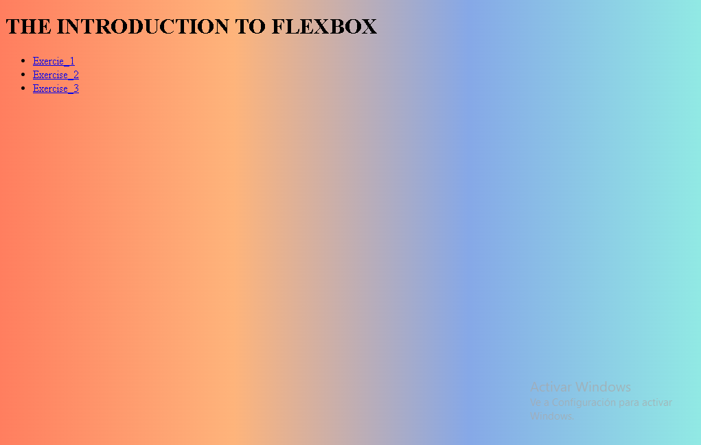

# Project Name

> This is an introduction to flexbox.

     

Additional description about the project and its features.

## Built With

- Major languages
- Frameworks
- Technologies used

## Live Demo

[Live Demo Link](https://jokerjaas2002.github.io/introduction_to_flexbox/)

## Getting Started

**This code is a web page with the Tribute to Dr. Norman Borlaug**

To get a local copy up and running follow these simple example steps.

### Prerequisites

### Setup

### Install

### Usage

### Run tests

### Deployment

## Authors

👤 **JOEL ANDRES ACOSTA SENTENO**

- GitHub: [@jokerjaas2002](https://github.com/jokerjaas2002)

🤝 Contributing
Contributions, issues, and feature requests are welcome!

Feel free to check the
[issues page](../../issues/).

## Show your support

Give a ⭐️ if you like this project!

## Acknowledgments

- Hat tip to anyone whose code was used
- Inspiration
- etc

## 📝 License

This project is [CC0 1.0 Universal](LICENSE) licensed.